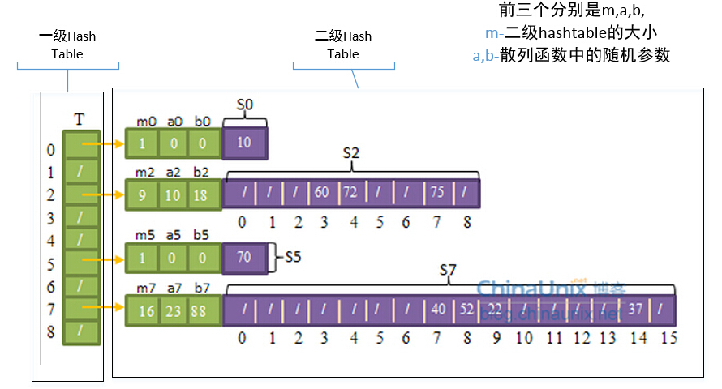

# Introduction to Algorithm

- 说明lgn是以2为底的对数
- 编译环境：g++ (Ubuntu 5.4.0-6ubuntu1~16.04.4) 5.4.0 20160609
- g++ -std=c++11 XX.cpp -o XX

##  第一课 算法分析
- 插入排序 [源码](https://github.com/xuyicpp/Classical_Algorithms/blob/master/Introduction_to_Algorithms/Insertion_Sort.cpp)
- 归并排序 [源码](https://github.com/xuyicpp/Classical_Algorithms/blob/master/Introduction_to_Algorithms/Merge_Sort.cpp)

## 第二课 渐近符号、递归及解法

- f(n)的值总位于c1g(n)与c2g(n)之间或等于它们，那么记f(n)=Θ(g(n))。
- f(n)的值总小于或等于cg(n),那么记f(n)=O(g(n))。
- f(n)的值总大于或等于cg(n),那么记f(n)=Ω(g(n))。
- 用主方法求解递归式，
如下图：

另外这一篇BLOG详细了介绍了这种方法的用途：[BLOG](http://www.jianshu.com/p/4d0b005782d9)

## 第三课 分冶法（Divide and Conquer）
- 二分法 [源码](https://github.com/xuyicpp/Classical_Algorithms/blob/master/Introduction_to_Algorithms/Binary_Search.cpp)
- 菲波那切数列 [源码](https://github.com/xuyicpp/Classical_Algorithms/blob/master/Introduction_to_Algorithms/Fibonacci.cpp)
- 结：朴素递归算法用时太多，实用价值不大，自底向上算法效率为线性，较高，平时用较多，递归平方算法效率为对数级，且编程可实现，实用价值很大。并且经过测试，当n值变很大后，递归平方算法效率明显高于自底向上算法效率。[BLOG](http://www.cnblogs.com/zhoutaotao/p/3964997.html)

## 第四课 快排及随机化算法
- 快速排序及随机快速排序 [源码](https://github.com/xuyicpp/Classical_Algorithms/blob/master/Introduction_to_Algorithms/Quick_Sort.cpp)
- Hoare的代码对快排有重复的情况运行的更好。
- 随机化快速排序，其运行时间不依赖于输入序列的顺序Θ(nlgn),一般来说比归并快3倍。
- 这篇博客对此进行了详细的介绍我就摘录了一些 [BLOG](http://www.cnblogs.com/zhoutaotao/p/3970099.html)
自我小结：对随机产生的数组进行排序，1）可以发现插入排序没有优势、特别是数组比较大时耗时太多；2）快速排序、随机化快速排序、归并排序性能不错，然而两种快排比归并排序性能好点；3）当数据量变大时，可以看出性能排序为快速排序、随机化快速排序、归并排序、插入排序；4）由于这里的数组是由随机数产生的，没有显示出随机化快速排序的优势，但是当数组为已排序情况下随机化快排将比快排性能好。

- 附：堆排序：[源码](https://github.com/xuyicpp/Classical_Algorithms/blob/master/Introduction_to_Algorithms/Heapsort.cpp) [算法详解](https://jingyan.baidu.com/article/5225f26b057d5de6fa0908f3.html)(注：这里的堆顶的下标是从1开始的)

## 第五课 线性时间排序

- 在最坏情况下，任何比较排序算法都需要做Ω(nlgn)次比较。故堆排序和归并排序都是渐进最优的比较排序算法。
- 计数排序 [源码](https://github.com/xuyicpp/Classical_Algorithms/blob/master/Introduction_to_Algorithms/Counting_Sort.cpp)

它的优势在于在对一定范围内的整数排序时，它的复杂度为Ο(n+k)（其中k是整数的范围），快于任何比较排序算法。当然这是一种牺牲空间换取时间的做法，而且当O(k)>O(n*log(n))的时候其效率反而不如基于比较的排序（基于比较的排序的时间复杂度在理论上的下限是O(n*log(n)), 如归并排序，堆排序）

- 基数排序 [源码](https://github.com/xuyicpp/Classical_Algorithms/blob/master/Introduction_to_Algorithms/Radix_Sort.cpp)

源码中实现排序的代码是和计数排序一样的。
基数排序（radix sort）属于“分配式排序”（distribution sort），又称“桶子法”（bucket sort）或bin sort，顾名思义，它是透过键值的部份资讯，将要排序的元素分配至某些“桶”中，藉以达到排序的作用，基数排序法是属于稳定性的排序，其时间复杂度为O (nlog(r)m)，其中r为所采取的基数，而m为堆数，在某些时候，基数排序法的效率高于其它的稳定性排序法。

## 第六课 顺序统计、中值

- 随机选择算法(一般选择这个) [源码](https://github.com/xuyicpp/Classical_Algorithms/blob/master/Introduction_to_Algorithms/Randomized_Select.cpp) :

运行时间的复杂度期望是Θ(n),最坏的情况复杂度为Θ(n2)。

- 最坏线性选择算法 [源码](https://github.com/xuyicpp/Classical_Algorithms/blob/master/Introduction_to_Algorithms/Worse_Linear_Select.cpp) :

相比于上面的随机选择，我们有另一种类似的算法，它在最坏情况下也能达到O(n)。它也是基于数组的划分操作，而且利用特殊的手段保证每次划分两边的子数组都比较平衡；与上面算法不同之处是：本算法不是随机选择主元，而是采取一种特殊的方法选择“中位数”，这样能使子数组比较平衡，避免了上述的最坏情况（Ө(n^2)）。选出主元后，后面的处理和上述算法一致。

参考博客 [BLOG](http://www.cnblogs.com/zhoutaotao/p/4047082.html)

## 第七课 哈希表(hash table)

- 代码采用开放寻址法处理冲突，包括线性探查、二次探查、双重散列探查、随机散列探查实现(探查法采用二次探查)；散列函数采用简单的除法散列函数；当插入一个新元素产生冲突次数过多时，进行再散列。[源码](https://github.com/xuyicpp/Classical_Algorithms/blob/master/Introduction_to_Algorithms/HashTable.cpp)

散列表是普通数组概念的推广，在散列表中，不是直接把关键字用作数组下标，而是根据关键字通过散列函数计算出来的。

当实际存储的关键字数目比全部的可能关键字总数要小时，采用散列表就成为直接数组寻址的一种有效的替代。

关键技术：
- 直接寻址、散列寻址
- 散列函数(除法散列、乘法散列、全域散列、完全散列)
- 碰撞处理方法：链表法、开放寻址法(线性探查、二次探查、双重散列、随机散列)
- 再散列问题

参考博客 [网易公开课算法导论第七课 ——哈希表](http://www.guokr.com/blog/483397/)、
[网易公开课算法导论第七课 ——哈希表](http://www.cnblogs.com/zhoutaotao/p/4067749.html)

## 第八课 全域哈希和完全哈希(Universal hashing and Perfect hashing)

- 任何一个特定的散列函数都可能将特定的n个关键字全部散列到同一个槽中，使得平均的检索时间为Θ(n)。为了避免这种情况，唯一有效的改进方法是随机地选择散列函数，使之独立与要存储的关键字。这种方法称为全域散列(universal hashing)。全域散列在执行开始时，就从一组精心设计的函数中，随机地选择一个作为散列函数。因为随机地选择散列函数，算法在每一次执行时都会有所不同，甚至相同的输入都会如此。这样就可以确保对于任何输入，算法都具有较好的平均情况性能. 

- 首先第一级使用全域散列把元素散列到各个槽中，这与其它的散列表没什么不一样。但在处理碰撞时，并不像链接法（碰撞处理方法）一样使用链表，而是对在同一个槽中的元素再进行一次散列操作。也就是说，每一个（有元素的）槽里都维护着一张散列表，该表的大小为槽中元素数的平方，例如，有3个元素在同一个槽的话，该槽的二级散列表大小为9。不仅如此，每个槽都使用不同的散列函数，在全域散列函数簇h(k) = ((a*k+b) mod p) mod m中选择不同的a值和b值，但所有槽共用一个p值如101。每个槽中的（二级）散列函数可以保证不发生碰撞情况。当第一级散列表的槽的数量和元素数量相同时(m=n)，所有的二级散列表的大小的总量的期望值会小于2*n，即Ө(n)。

## 第九课 二叉搜索树(binary search trees)

- 随机化二叉搜索树本质上与随机化的快速排序相等,既然二叉搜索树的BST排序和快速排序效率相同，那么我们为什么还要研究它呢？原因在于，本数据结构能够支持更加快速的动态操作，诸如删除、修改、插入等操作。

- Randomized Binary Search Trees Code [源码](https://github.com/xuyicpp/Classical_Algorithms/blob/master/Introduction_to_Algorithms/Randomized_BST_Sort.cpp)
- 参考BLOG [算法导论-二叉查找树](http://www.cnblogs.com/zhoutaotao/p/4096237.html)

## 第十课 平衡搜索树
- 红黑树的面试考点一般为，红黑树的特性和红黑树的基本操作：添加。

- 红黑树（Red Black Tree） 是一种自平衡二叉查找树，是在计算机科学中用到的一种数据结构，典型的用途是实现关联数组。它的统计性能要好于平衡二叉树(有些书籍根据作者姓名，Adelson-Velskii和Landis，将其称为AVL-树)

- 红黑树的应用比较广泛，主要是用它来存储有序的数据，它的时间复杂度是O(lgn)，效率非常之高。例如，Java集合中的TreeSet和TreeMap，C++ STL中的set、map，以及Linux虚拟内存的管理，都是通过红黑树去实现的。

- 红黑树的特性：
(1) 每个节点或者是黑色，或者是红色。
(2) 根节点是黑色。
(3) 每个叶子节点是黑色。 [注意：这里叶子节点，是指为空的叶子节点！]
(4) 如果一个节点是红色的，则它的子节点必须是黑色的。
(5) 从一个节点到该节点的子孙节点的所有路径上包含相同数目的黑节点。

- 红黑树的基本操作：添加
第一步：将红黑树当做一颗二叉查找，将节点插入。
第二步：将插入的节点着色为“红色”。
第三步：通过一系列的旋转或着色等操作，使之重新成为一颗红黑树。

- 其中第三步一共有根据父节点以及祖父节点、叔叔节点共分为5种情况。但核心思想都是将红色的节点移到根节点；然后将根节点设为黑色。

- 红黑树的基本操作：删除
第一步：将红黑树当作一颗二叉查找树，将节点删除。
第二步：通过“选转和重新着色”等一系列来修正该树，使之重新成为一颗红黑树。（分为四种情况）

- 源码:[RedBlackTree.h](https://github.com/xuyicpp/Classical_Algorithms/blob/master/Introduction_to_Algorithms/RedBlackTree.h)、[RedBlackTreeTest.cpp](https://github.com/xuyicpp/Classical_Algorithms/blob/master/Introduction_to_Algorithms/RedBlackTreeTest.cpp)

- 参考BLOG:[红黑树(一)之 原理和算法详细介绍](http://www.cnblogs.com/skywang12345/p/3245399.html)、[红黑树(四)之 C++的实现](http://www.cnblogs.com/skywang12345/p/3624291.html)。

- 附录:[do..while(0)的用法](http://www.cppblog.com/woaidongmao/archive/2009/03/11/76211.html)

## 第十一课 扩充的数据结构、动态有序统计和区间树

### 方法论：如<OSTree—顺序统计树>
- 1：选择一个基础的数据结构(red-black tree)
- 2：在数据统计中维护一些附加信息(子树大小)
- 3：验证这个数据结构上的信息不会受修改操作的影响(insert, delete---rotations)
- 4：建立新的运算。假设新的数据已经存好了，然后开始使用这些信息(os_select, os_rank).

- 动态顺序统计(红黑树实现):一种支持一般动态集合上，顺序统计操作的数据结构。通过这种数据结构，可以快速地找到一个集合中的第i小的数，（select）或给出一个指定元素在集合的全序中的位置。（rank）

- 源码：[DynamicOrderStatisticsTree.h](https://github.com/xuyicpp/Classical_Algorithms/blob/master/Introduction_to_Algorithms/DynamicOrderStatisticsTree.h)、[DOSTree.cpp](https://github.com/xuyicpp/Classical_Algorithms/blob/master/Introduction_to_Algorithms/DOSTree.cpp)、[DynamicOrderStatisticsTreeTest.cpp](https://github.com/xuyicpp/Classical_Algorithms/blob/master/Introduction_to_Algorithms/DynamicOrderStatisticsTreeTest.cpp)

- 区间树:一种对动态集合进行维护的红黑树，其中每个元素x都包含一个区间x.int。
区间树支持下列操作：
（1）INTERVAL-INSERT( T, x )：将包含区间属性的int的元素x插入到树T中。
（2）INTERVAL-DELETE( T, x )：从T删除x。
（3）INTERVAL-SEARCH( T, i )：返回一个指向T中元素x的指针，使x.int与i重叠。不存在返回T.nil。

- 源码：[IntervalTree.h](https://github.com/xuyicpp/Classical_Algorithms/blob/master/Introduction_to_Algorithms/IntervalTree.h)、[IntervalTree.cpp](https://github.com/xuyicpp/Classical_Algorithms/blob/master/Introduction_to_Algorithms/IntervalTree.cpp)、[InternalTreeTest.cpp](https://github.com/xuyicpp/Classical_Algorithms/blob/master/Introduction_to_Algorithms/InternalTreeTest.cpp)

- 参考BLOG:[MIT：算法导论——11.扩充的数据结构、动态有序统计和区间树](http://blog.csdn.net/loveprogram_1/article/details/32318211)、[算法系列笔记5(扩展数据结构-动态顺序统计和区间树)](http://blog.csdn.net/lu597203933/article/details/43459035)

## 第十二课 跳跃表

### skip list 介绍

- Skip list是一个用于有序元素序列快速搜索的数据结构，由美国计算机科学家William Pugh发明于1989年。它的效率和红黑树以及 AVL 树不相上下，但实现起来比较容易。Skip list是一个“概率型”的数据结构，可以在很多应用场景中替代平衡树。Skip list算法与平衡树相比，有相似的渐进期望时间边界，但是它更简单，更快，使用更少的空间。 
Skip list是一个分层结构多级链表，最下层是原始的链表，每个层级都是下一个层级的“高速跑道”。

### skip list 空间分析

- 假设一个链表的长度为T=2ⁿ，每次提升的概率为P=1/2，由等比公式可得存储的空间为2T，所以空间复杂度为2 * Θ(T) ≈ Θ(n)。查找、插入、删除的时间复杂度为Θ(㏒n)。

- 源码:[SkipList.cpp](https://github.com/xuyicpp/Classical_Algorithms/blob/master/Introduction_to_Algorithms/SkipList.cpp)

- 参考BLOG:[跳跃表以及C++实现](http://blog.csdn.net/yinlili2010/article/details/39503655)、[【算法导论】 第十二课 跳跃表](http://blog.csdn.net/lth404391139/article/details/45111689)、[【算法导论33】跳跃表（Skip list）原理与java实现](http://blog.csdn.net/brillianteagle/article/details/52206261)、[数据结构与算法(c++)——跳跃表(skip list)](http://www.cnblogs.com/learnhow/p/6749648.html)

## 第十三课 平摊分析，表的扩增，势能方法

### 平摊分析概念

- 平摊分析对于有实时需求的场合不太适合。(实时操作系统必须及时响应所要求的任务，在限定时间内完成任务。非实时的操作系统，多时间不是很敏感，对所要求的任务只是会保证完成，但在什么时候完成，或用多长的时间完成就不一定了。)

- 参考BLOG:[算法课笔记系列（七）—— 平摊分析](http://www.mamicode.com/info-detail-1345652.html)、[算法设计分析之一（平摊分析，表扩增，势能方法）](http://blog.csdn.net/onyheart/article/details/15797499)

